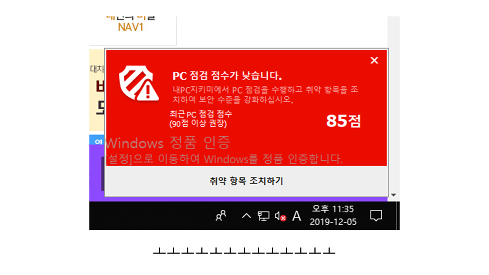

# kill-MyPcToast.exe

기숙사 인강실 컴퓨터에 깔려있는 내PC지키미의 PC 점검 점수 경고 팝업을 보이지 않게 하기 위해 만들었습니다.  
인강 보는데 계속 방해되서 일렉트론 공부할겸 만들었습니다.  
시험기간에 오랫동안 컴퓨터 잡고 있긴 힘들어서 일렉트론 공식 예제에 코드를 좀 붙여서 짰습니다.  
그냥 MyPCToast.exe 프로세스 종료 코드를 루프로 돌려 실행합니다.  

## 경고
그런데 기숙사 컴퓨터에 일렉트론 모듈이 안깔려서 실행을 안시켜봤습니다.

## 라이선스
일단 예제를 가져온 공식 문서는 MIT라이선스로 배포되고 있으니 그쪽 따라가겠습니다.  
